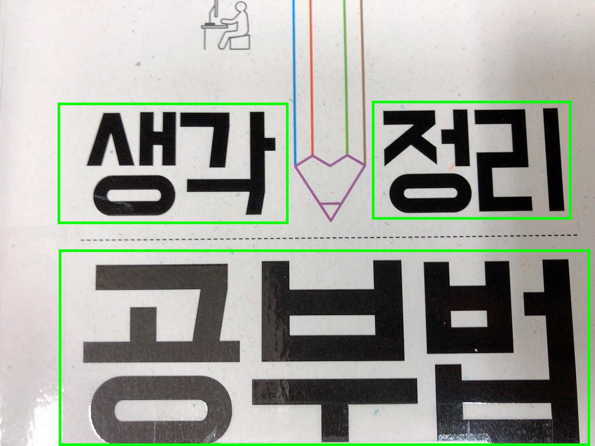
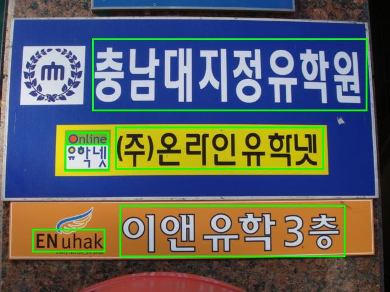
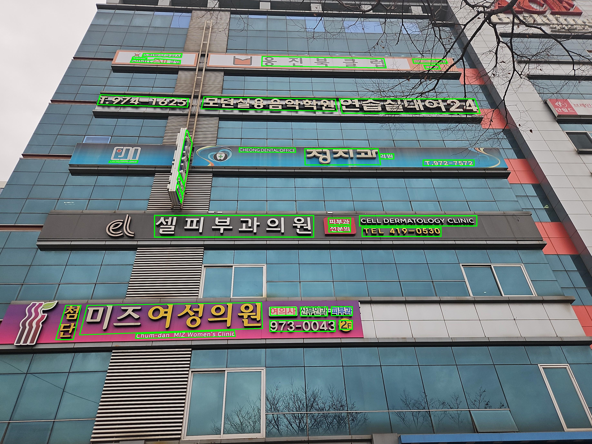
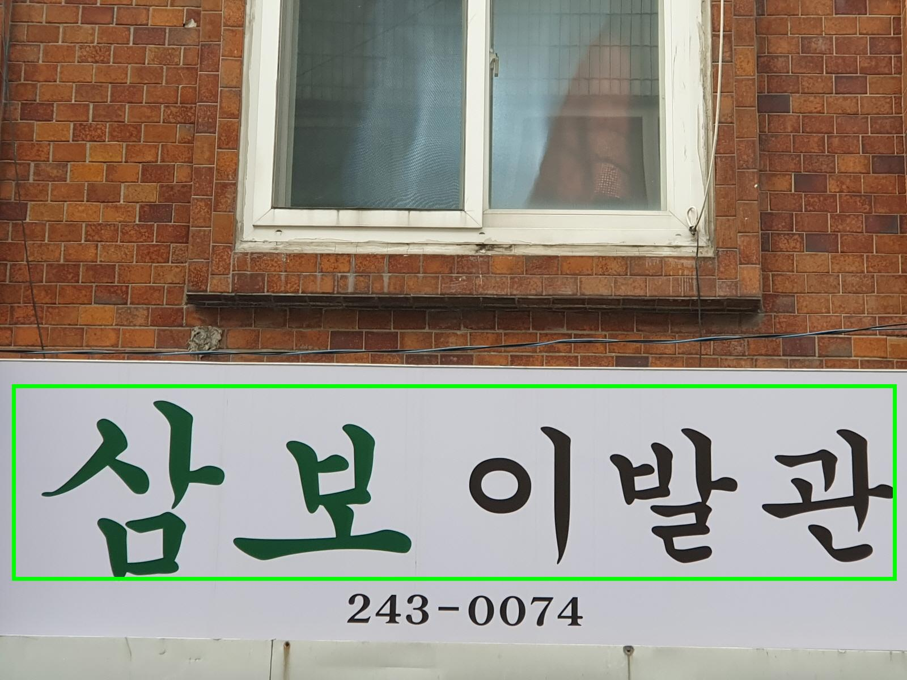
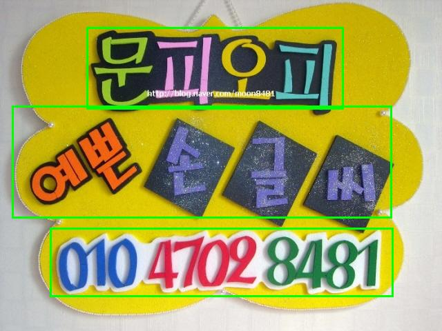
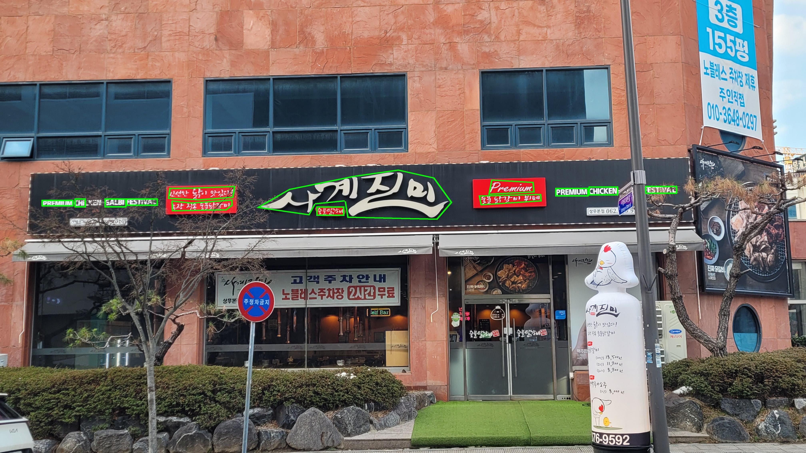
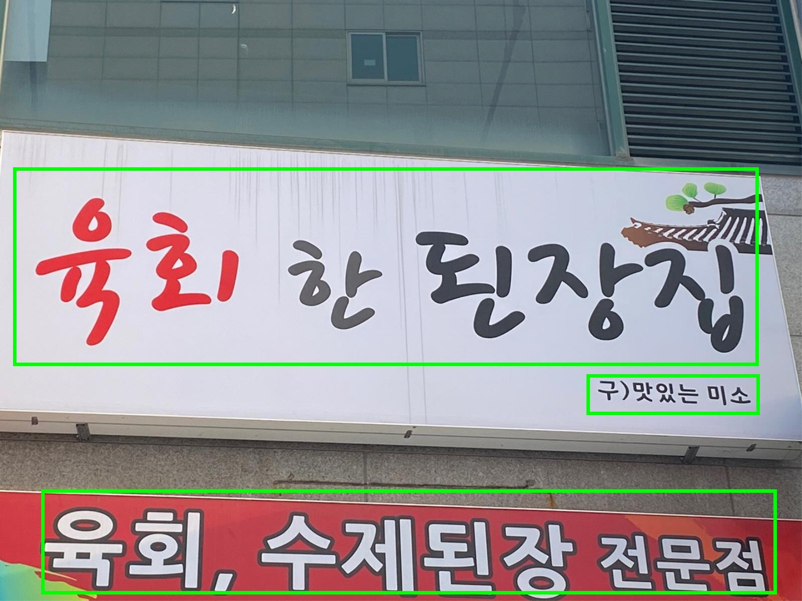
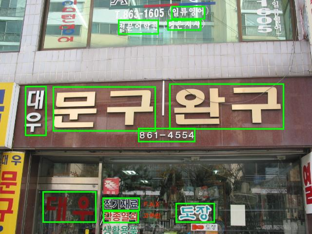
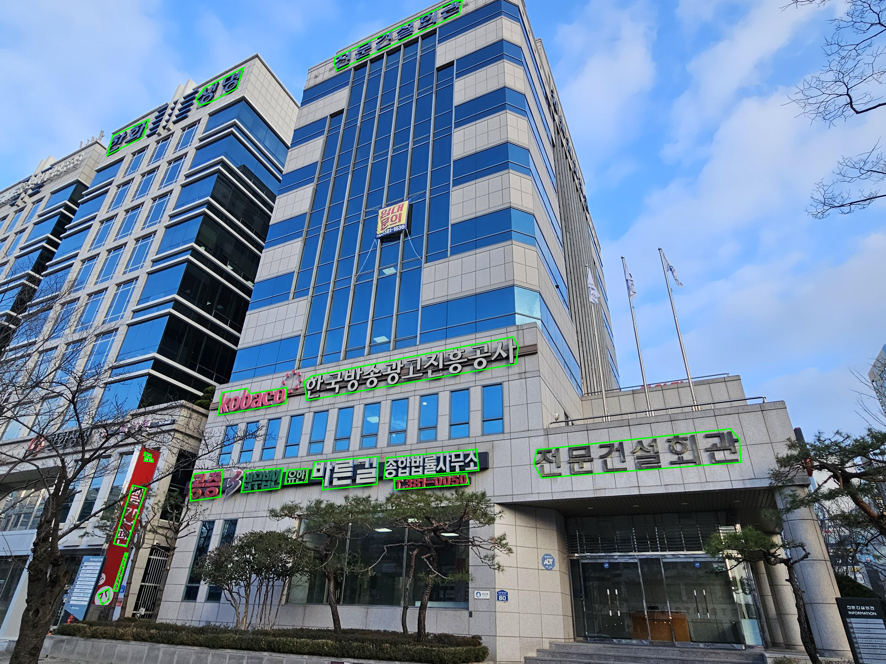

# K-STR-Bench

**K-STR-Bench: A Challenge-Aware Benchmark Suite for Korean Scene Text Recognition**  
Myounghun Han, Jin-Hyuk Hong · ACCV 2026

[Paper](#citation) | [GitHub](https://github.com/hoonisone/K-STR-Bench) | [Hugging Face](https://huggingface.co/datasets/hoonisone/K-STR-Bench) | Experiments (will be released soon)

A challenge-aware benchmark suite for Korean scene text recognition. It unifies three subsets under one evaluation protocol:

- **AIHub_Standardized**
- **GIST_Signboard**
- **KAIST_Corrected**

These subsets have different origins and licenses. See [License](#license).

## Overview

K-STR-Bench provides standardized sample IDs, unified annotations, train/val/test splits, reviewed labels, and preprocessing scripts.


| Subset             | Images            | Labels / Metadata                                                   | Distribution                                       |
| ------------------ | ----------------- | ------------------------------------------------------------------- | -------------------------------------------------- |
| AIHub_Standardized | Not redistributed | K-STR-Bench-specific metadata and independently re-annotated labels | Users obtain the original data directly from AIHub |
| GIST_Signboard     | Provided          | Provided                                                            | Distributed directly through K-STR-Bench           |
| KAIST_Corrected    | Provided          | Provided                                                            | Distributed under the original KAIST license       |


## Examples


| AIHub_Standardized                                  | KAIST_Corrected                                | GIST_Signboard                               |
| --------------------------------------------------- | ---------------------------------------------- | -------------------------------------------- |
|   |  |  |
|  |   |   |
|  |   |   |


## Usage

Developed and tested on **Windows 11**. Python **3.10+** is required.

Install the package, then prepare the benchmark in three steps: download the released resources, reconstruct AIHub_Standardized locally, and generate STR label files.

### Install

A PyPI package is not published yet. Install `kstrbench` directly from GitHub:

```bash
pip install git+https://github.com/hoonisone/K-STR-Bench.git
```

`python -m kstrbench...` uses that install.

### 1. Download data resources and set the path

Download the released resources (`GIST_Signboard`, `KAIST_Corrected`, and related metadata). Original AIHub images are not included.

Set `DATASET_DIR` to the folder where the benchmark data should live. Commands read that variable when `--output` or `--dataset-dir` is omitted. Passing either flag overrides it. Use forward slashes in the path on either system.

The variable lasts for the current terminal. Open a new terminal after the persistent command.

Windows PowerShell, current terminal:

```powershell
$env:DATASET_DIR = "D:/K-STR-Bench"
```

Windows CMD, current terminal:

```bat
set "DATASET_DIR=D:/K-STR-Bench"
```

Windows PowerShell or CMD, later terminals too:

```bat
setx DATASET_DIR "D:/K-STR-Bench"
```

Linux, current terminal:

```bash
export DATASET_DIR=/data/K-STR-Bench
```

Linux, later terminals too. Add the `export` line to `~/.bashrc`, then open a new terminal.

Choose **one** of the following methods.

#### How to download via Hugging Face

`core` (default) downloads only STR crops and text tables (`text_images/`, `text.csv`, `text.v*.csv`, `text.patch.v*.csv`):

```bash
python -m kstrbench.download --mode core
```

`all` downloads the full release, including scene images:

```bash
python -m kstrbench.download --mode all
```


#### How to download via Cloud

Coming soon.

### 2. Prepare AIHub_Standardized

The original AIHub dataset cannot be redistributed. Download it yourself and run the cleaning and patch pipeline in this repository. Details are in [AIHub policy](#aihub-policy).

The original archives are about **450 GB**. Download and standardization also create intermediate files, so keep about **1 TB** of free disk space.

#### Download

Download **야외 실제 촬영 한글 이미지** from [AIHub](https://aihub.or.kr/) / [the dataset page](https://aihub.or.kr/aihubdata/data/view.do?currMenu=115&topMenu=100&searchKeyword=%EC%95%BC%EC%99%B8%20%EC%8B%A4%EC%A0%9C%20%EC%B4%AC%EC%98%81%20%ED%95%9C%EA%B8%80%20%EC%9D%B4%EB%AF%B8%EC%A7%80&aihubDataSe=data&dataSetSn=105).

#### Place the download

```text
<DATASET_DIR>/
└── AIHub_zip/
    ├── 030.야외실제촬영한글이미지/
    └── 야외실제촬영한글이미지/
```


#### Run

```bash
python -m kstrbench.aihub.standardize
```

The pipeline uses many multi-process and multi-thread jobs and may take about **30 minutes to 1 hour**. It writes:

```text
<DATASET_DIR>/AIHub_Standardized/
├── scene_images/
├── text_images/
└── text.v2.0.csv
```


### 3. Generate STR labels

```bash
python -m kstrbench.make_label
```

`kstrbench.make_label` writes split lists and challenge tag lists into each subset folder:

```text
<DATASET_DIR>/AIHub_Standardized/labels/
├── train.txt
├── val.txt
└── test.txt

<DATASET_DIR>/GIST_Signboard/labels/
├── test.txt
├── artistic.txt
├── curve.txt
├── sailent.txt
├── incomplete.txt
├── multi_oriented.txt
└── low_visibility.txt

<DATASET_DIR>/KAIST_Corrected/labels/
├── test.txt
└── ...
```

Use the dataset folder as `dataset_dir` and these `.txt` files as the `labelfile` for training or evaluation.

## Dataset Structure

AIHub_Standardized, GIST_Signboard, and KAIST_Corrected share one layout: **scene** images, **text** crops, and CSV tables keyed by unique IDs. See [docs/dataset_structure.md](docs/dataset_structure.md).

After all steps, the dataset folder looks like this:

```text
K-STR-Bench/
├── AIHub_zip/                      # original AIHub download (user-provided)
│   ├── 030.야외실제촬영한글이미지/
│   └── 야외실제촬영한글이미지/
├── AIHub_Standardized/
│   ├── scene_images/
│   ├── text_images/
│   ├── text.v2.0.csv
│   └── labels/
├── GIST_Signboard/
│   ├── scene_images/
│   ├── text_images/
│   ├── scene.csv
│   ├── text.v1.0.csv
│   └── labels/
├── KAIST_Corrected/
│   ├── scene_images/
│   ├── text_images/
│   ├── scene.csv
│   ├── text.v2.0.csv
│   └── labels/
```

`GIST_Signboard` and `KAIST_Corrected` share the same layout. `AIHub_Standardized` is produced locally. Split and challenge label files live in each subset's `labels/` folder. AIHub_Standardized has `train` / `val` / `test`; GIST_Signboard and KAIST_Corrected are evaluation-only (`test.txt`) and also have one file per challenge tag.

## Data Sources

**AIHub_Standardized.** Derived from [야외 실제 촬영 한글 이미지](https://aihub.or.kr/aihubdata/data/view.do?currMenu=115&topMenu=100&searchKeyword=%EC%95%BC%EC%99%B8%20%EC%8B%A4%EC%A0%9C%20%EC%B4%AC%EC%98%81%20%ED%95%9C%EA%B8%80%20%EC%9D%B4%EB%AF%B8%EC%A7%80&aihubDataSe=data&dataSetSn=105). The original AIHub data are not distributed here. See [AIHub policy](#aihub-policy).

**GIST_Signboard.** Collected and annotated by the K-STR-Bench authors. Images and annotations are released with this benchmark under **CC BY 4.0**.

**KAIST_Corrected.** Derived from the **KAIST Scene Text Database**, redistributed under **CC BY-SA 3.0**. Organization, preprocessing, and annotations may differ from the original KAIST release.

## AIHub Policy

K-STR-Bench does not redistribute original AIHub images or original AIHub annotation files. Users must obtain that source dataset from AIHub and follow the AIHub Terms of Use.

This repository provides only author-created resources: sample IDs, split information, preprocessing and standardization code, reviewed metadata, and independently re-annotated transcription labels. Those labels were produced by inspecting the source images with a dedicated labeling tool. They are not copies of the original AIHub annotation files.

The local pipeline combines the user-obtained AIHub data with these K-STR-Bench resources.

## License

K-STR-Bench does **not** use a single license for all files.


| Resource                                      | License / Terms                                  |
| --------------------------------------------- | ------------------------------------------------ |
| K-STR-Bench source code                       | MIT License                                      |
| K-STR-Bench-specific metadata                 | CC BY 4.0                                        |
| K-STR-Bench IDs and benchmark splits          | CC BY 4.0                                        |
| K-STR-Bench independently created annotations | CC BY 4.0                                        |
| GIST_Signboard images and annotations         | CC BY 4.0                                        |
| KAIST_Corrected                               | CC BY-SA 3.0                                     |
| Original AIHub images and annotations         | Not redistributed; subject to AIHub Terms of Use |


CC BY 4.0 applies only to resources independently created and distributed by the K-STR-Bench authors. It does not apply to the original AIHub dataset. KAIST_Corrected remains under CC BY-SA 3.0.

K-STR-Bench does not claim ownership of third-party source datasets. Users are responsible for complying with each source license.

## Citation

If you use K-STR-Bench in your research, please cite our paper:

```bibtex
@inproceedings{han2026kstrbench,
    title     = {K-STR-Bench: A Challenge-Aware Benchmark Suite for Korean Scene Text Recognition},
    author    = {Han, Myounghun and Hong, Jin-Hyuk},
    booktitle = {Asian Conference on Computer Vision (ACCV)},
    year      = {2026}
}
```

Please also cite the original datasets when using the corresponding subsets.

## Versioning

Use these label versions for K-STR-Bench. Version history is in each subset README.


| Subset             | Latest |
| ------------------ | ------ |
| AIHub_Standardized | 2.0    |
| KAIST_Corrected    | 2.0    |
| GIST_Signboard     | 1.0    |


- [AIHub_Standardized](docs/AIHub_Standardized.md#version-history)
- [KAIST_Corrected](docs/KAIST_Corrected.md#version-history)
- [GIST_Signboard](docs/GIST_Signboard.md#version-history)


## Acknowledgements

We thank the creators and maintainers of AIHub and the KAIST Scene Text Database, and all contributors to GIST_Signboard.

## Contact

For questions about K-STR-Bench, open an issue in this repository. For access to the original AIHub dataset, contact AIHub directly.