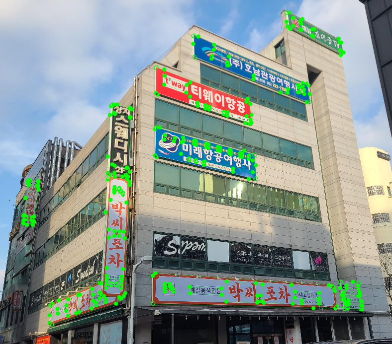
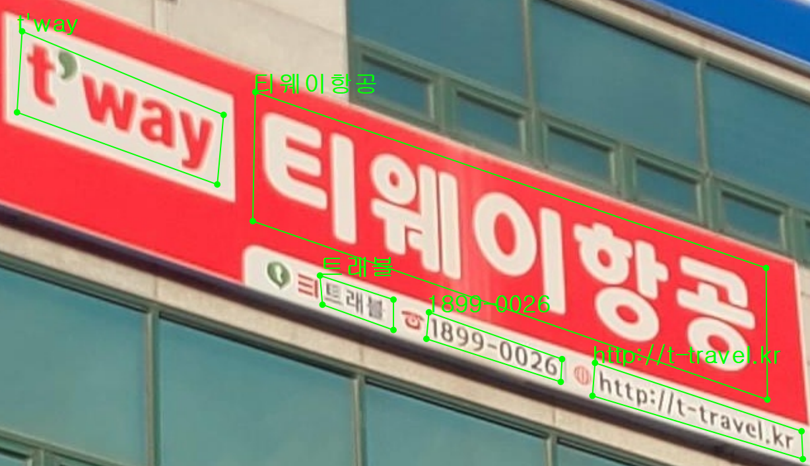

# GIST_Signboard

**GIST_Signboard** is a newly collected real-world signboard dataset for Korean scene text recognition. It is the hardest evaluation subset in the suite: unconstrained outdoor signboard text that existing Korean STR resources cover only sparsely.

Download, splits, and license notes are in the [root README](../README.md).

## What it is

Images were collected on urban streets in South Korea (Sangmu district, Gwangju) with smartphones, from a pedestrian viewpoint. Capture was not controlled for viewpoint, distance, lighting, background, or text appearance. A scene image typically contains several signboards and several text instances — storefronts, advertisements, and street backgrounds together.

Devices used for collection include Samsung Galaxy A16, Galaxy S20+, Galaxy S22+, Galaxy S23, and Apple iPhone 12 Pro Max. Visible faces and vehicle license plates are blurred.

Each text instance has a polygon and a transcription. Transcriptions were labeled on the cropped **text** image, not the full **scene**, so annotators could not guess unreadable characters from surrounding context. For the cropped STR format used in K-STR-Bench, text images are axis-aligned crops around those polygons.

## Labels

A **scene** image can contain several signboards. Green polygons mark signboard regions.



Each signboard has **text** instances. Green polygons mark text regions, and the overlay shows the transcription (`label`).



`text.v1.0.csv` stores these annotations together: `scene_id`, `signboard_id`, text `points`, `label`, and the cropped `image_path`. Challenge tags used by K-STR-Bench (`KSTR_is_*`) are in the same table.

## Statistics


|                                     | Count  |
| ----------------------------------- | ------ |
| scene                               | 5,185  |
| text                                | 34,687 |
| Korean-only text (K-STR-Bench eval) | 16,078 |


GIST_Signboard is evaluation-only. `kstrbench.make_label` writes `GIST_Signboard/labels/test.txt` and one file per challenge tag in the same folder.

## Layout

```text
GIST_Signboard/
├── scene_images/
├── text_images/
├── scene.csv
└── text.v1.0.csv
```


## Version history


| Version           | What it is                                             |
| ----------------- | ------------------------------------------------------ |
| **1.0** (current) | Original GIST_Signboard labels. File: `text.v1.0.csv`. |


## License

Images and annotations are released under **CC BY 4.0**. See the [root README](../README.md#license).

## Citation

Cite the K-STR-Bench paper. The BibTeX entry is in the [root README](../README.md#citation).